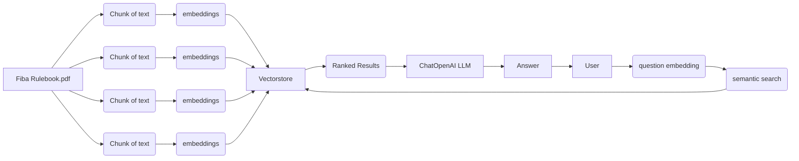

# Basketball Referee Chatbot

This chatbot is generating the answer to your questions about basketball rules based on the official FIBA Rulebook using RAG technology.

# Screenshots

# How does it work?

# How to use?

In order to use this program, you need to run it on your local computer. For this you'll need Python (3.X) on your computer.

- Download or Clone this repository on your computer
- Install the models in the requirements.txt using PIP
`pip install requirements.txt`
- Run the app.py file
- Visit localhost:5000 to access the web GUI

